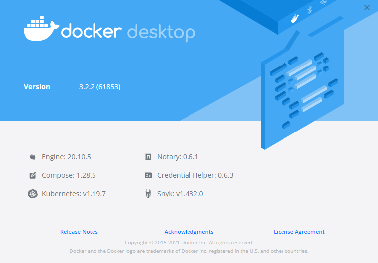
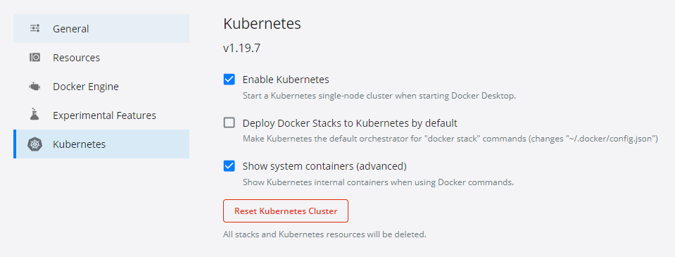

# Kubernetes

## Prerequisites

### Kubernetes cluster

Tested on:
Windows Docker Desktop :


Make sure you're in the correct directory

```shell
cd deploy/k8s
```

Make sure you have a running kubernetes cluster to which you can connect with `kubectl`. Find out how to install at [kubernetes.io](https://kubernetes.io/docs/tasks/tools/).

I use the docker desktop version with these settings:



## Self-signed Certificates

We use self-signed certificates instead of LetsEncrypt as that would require either a proper DNS or an accessible HTTP endpoint. Neither might be an option, so we'll go with the self-signed for now. We could extend it further later on.

To generate the certficates for `k8s.local` and `*.k8s.local`, use [mkcert](https://github.com/FiloSottile/mkcert) which you can install easily with `choco install mkcert`.

```powershell
mkcert -cert-file k8s.local.crt -key-file k8s.local.key k8s.local *.k8s.local infrastructure.k8s.local *.infrastructure.k8s.local
mkcert -pkcs12 k8s.local.pfx k8s.local *.k8s.local *.k8s.local infrastructure.k8s.local *.infrastructure.k8s.local
```

## Helm Charts

Install Helm on your host:

=== "Windows"
    ```powershell
    choco install kubernetes-helm
    ```
=== "Linux"
    ```bash
    curl https://baltocdn.com/helm/signing.asc | sudo apt-key add -
    sudo apt-get install apt-transport-https --yes
    echo "deb https://baltocdn.com/helm/stable/debian/ all main" | sudo tee /etc/apt/sources.list.d/helm-stable-debian.list
    sudo apt-get update
    sudo apt-get install helm
    ```
=== "MacOS"
    ```bash
    brew install helm
    ```

Make sure that helm repo's are up to date.

```powershell
helm repo add hashicorp https://helm.releases.hashicorp.com
helm repo add jaegertracing https://jaegertracing.github.io/helm-charts
helm repo add bitnami https://charts.bitnami.com/bitnami
helm repo add prometheus-community https://prometheus-community.github.io/helm-charts
helm repo add traefik https://helm.traefik.io/traefik
helm repo add datalust https://helm.datalust.co
helm repo add fluent https://fluent.github.io/helm-charts
helm repo update
```

> Stable Charts may have moved. Look at the [different repo's](https://github.com/helm/charts/issues/21103)

Now we deploy the controlplane part being consul, vault and jaeger

```powershell
kubectl apply -f infrastructure/namespace.yaml
```

<!-- ### CNI Plugin

```powershell
kubectl apply -f "https://cloud.weave.works/k8s/net?k8s-version=$(kubectl version | base64 | tr -d '\n')"
``` -->

### Kubernetes GUIs

#### Lens (optional)

There is a handy kubernetes UI that I use all the time called [Lens](https://k8slens.dev/).

#### Octant (optional)

Another GUI for kubernetes is [Octant](https://octant.dev/).

### Getting insight (optional)

Make sure you can connect to your k8s cluster and/or have an IDE like [Lens](https://k8slens.dev/) to see visually what is going on.

To create a (optional) topology map of your cluster use weave's [scope](https://www.weave.works/oss/scope/).

```powershell
kubectl create -f 'https://cloud.weave.works/launch/k8s/weavescope.yaml' --namespace=weave
kubectl port-forward service/weave-scope-app 4040:80 --namespace weave
```
