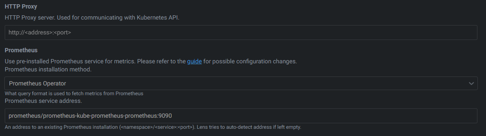

# Prometheus

## Installing

We'll install `prometheus` using the `prometheus operator`.

First setup the `helm` repo

```powershell
helm repo add prometheus-community https://prometheus-community.github.io/helm-charts
helm repo update
```

Next create the namespace and install the `kube-prometheus-stack` into it

```powershell
kubectl create namespace prometheus
helm install prometheus prometheus-community/kube-prometheus-stack --namespace prometheus -f .\infrastructure\prometheus\prometheus-values.yaml
```

The full values can be found at [https://github.com/prometheus-community/helm-charts/blob/main/charts/kube-prometheus-stack/values.yaml](https://github.com/prometheus-community/helm-charts/blob/main/charts/kube-prometheus-stack/values.yaml).

If traefik is already deployed ([here](./traefik.md)), then add a IngressRoute and expose `prometheus ui` through

```powershell
kubectl apply -f ./infrastructure/traefik/routes/prometheus.yaml
```

You can then access it through: [http://prometheus.localhost/](http://prometheus.localhost/)

### Configure Lens (optional)

Use the `Prometheus Operator` config and point it to the installed `prometheus` instance



### Grafana

### Through Traefik

If traefik is already deployed ([here](./traefik.md)), then expose grafana through

```powershell
kubectl apply -f ./infrastructure/traefik/routes/grafana.yaml
```

You can then access it through: [http://grafana.localhost/](http://grafana.localhost/)

### Through port-forward

To expose the UI of `grafana` directly, use:

```powershell
kubectl port-forward -n service/prometheus-grafana 3000:80 --namespace prometheus
```

You can then access it through: [http://localhost:3000/](http://localhost:3000/)

### References

- [https://linuxblog.xyz/posts/kube-prometheus-stack/](https://linuxblog.xyz/posts/kube-prometheus-stack/)
- [https://medium.com/platform-engineering/monitoring-traefik-with-grafana-1d037af5b952](https://medium.com/platform-engineering/monitoring-traefik-with-grafana-1d037af5b952)

